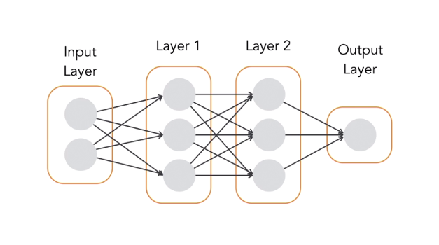
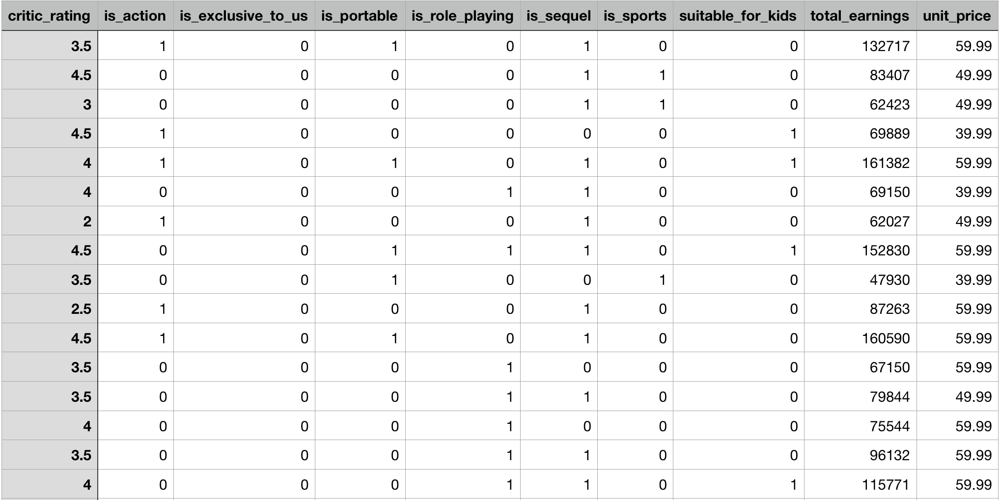
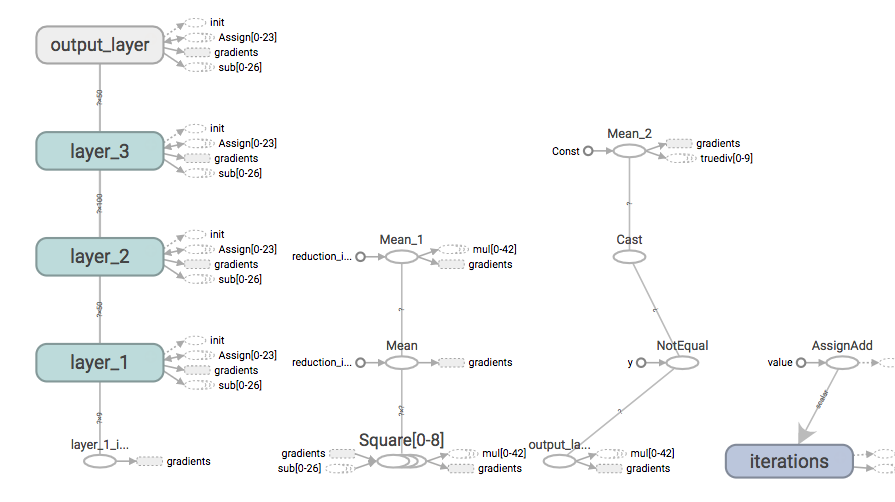
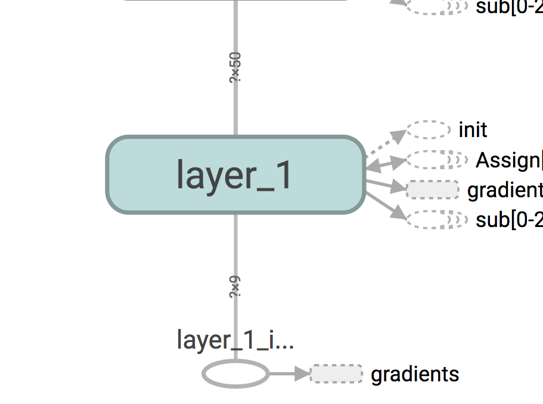
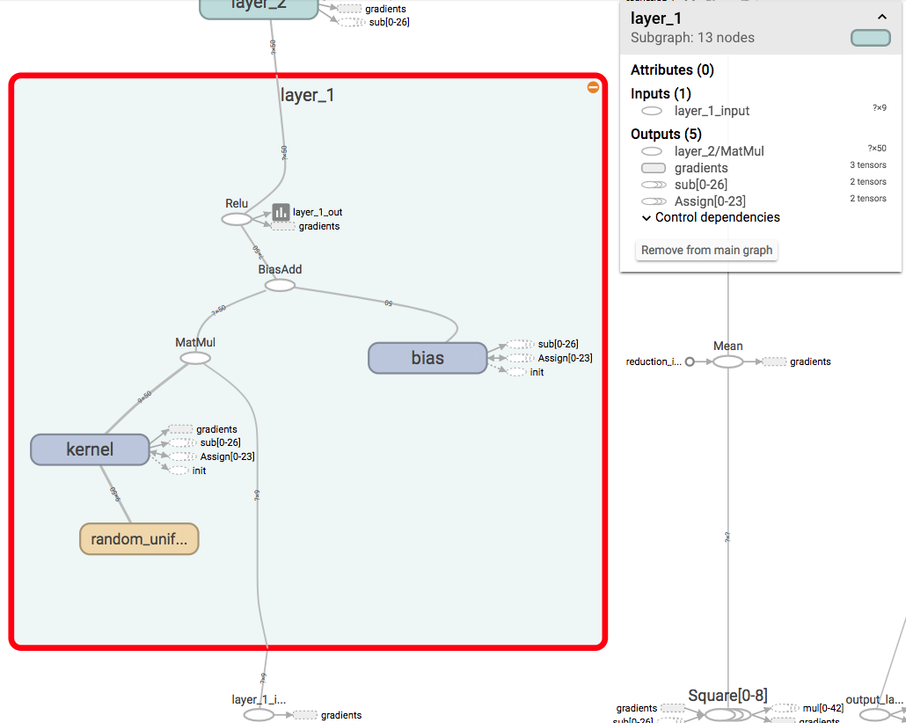
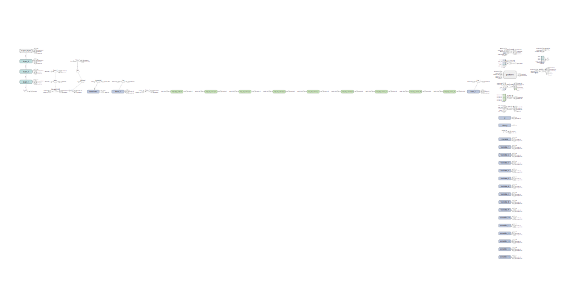
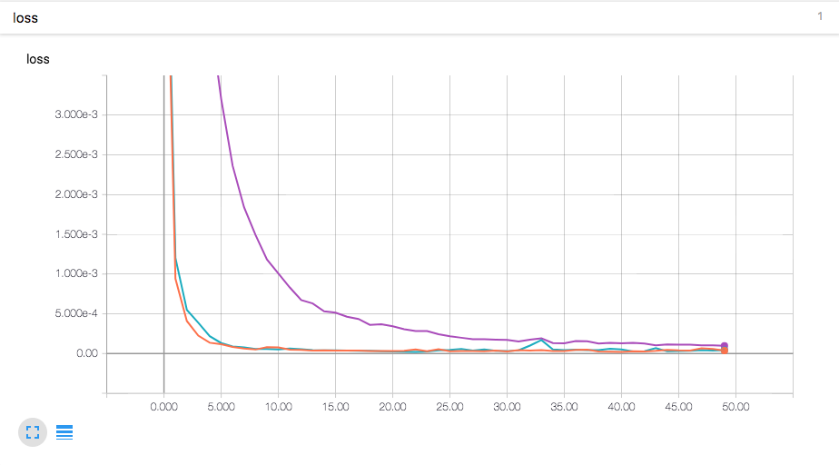

## 1 - Keras Overview

Keras is quickly becoming one of the most popular programming frameworks for deep learning, because it's quick and easy to use. With Keras, we can build state-of-the-art machine learning models with just a few lines of code.

Neural networks and deep learning are behind many of the recent breakthroughs in areas like image recognition, language translation, and speech recognition. Keras is a framework for building deep neural networks with Python. With Keras, we can build state-of-the-art, deep learning systems. Keras is designed to make it as easy as possible to build deep learning systems with as little complexity as possible. With Keras, you can build a deep neural network with only with only a few lines of code.

Keras doesn't do all of the work itself. It's really a front-end layer written in Python that runs on top of other popular deep learning toolkits like TensorFlow and Theano. At abstracts away a lot of the complexity of using those tools while still giving you many of the benefits. When you tell Keras to build a deep neural network, behind the scenes it builds out the neural network using either TensorFlow or Theano. In this course, we'll be using TensorFlow as the back-end. When you use Keras with TensorFlow, it builds a TensorFlow model and runs the training process for you.

That means that your model is compatible with most tools and utilities that work with TensorFlow. You can even upload your Keras model to Google's Cloud Machine learning system. One of the core principles of Keras is that best practices are built in. When building a deep learning system, there are many different parameters you have to configure. Keras always tries to provide good defaults for parameters. The default setting used in Keras are based on what has worked well for researchers in the past.

So more often than not, using the default settings in Keras will get you close to your goal. Even better, Keras comes with several pre-trained deep learning models for image recognition. You can use the pre-trained models to recognize common types of objects and images, or you can adapt these models to create a custom image recognition system with your own data.

## 2 - Setting Up

Dependencies are:
- [PyCharm (Community Edition)](www.jetbrains.com/pycharm/)
- [Python 3.6](https://www.python.org/downloads/)

Make sure the PyCharm Interpreter is set up to choose the right version pf Python (3.6) when opening the project. You may also need to install requirements that are listed in `requirements.txt` in each folder. These are really useful packages that help us get the job done.

## 3 - Creating a Neural Network in Keras

### **The train-test-evaluation flow**

We'll use Keras to build and train a supervised machine learning model. Supervised machine learning is the branch of machine learning where we train the model by showing it input data and the expected result for that data, and it works out how to transform the input into the expected output. When building a supervised machine learning model, there's a process we follow, called the model train test evaluation flow. First, we need to choose which machine learning algorithm we want to use. We can pick any standard machine learning algorithm, but with Keras, we'll always be using neural networks.

We train the NN by showing it training data and the expected output for that data, and it has to figure out how to replicate the expected result. After training, we load up new data (test data) to make sure the model actually learned how to solve the problem. Once it's trained and tested, we use it in the real world. This is the evaluation phase.

Keras makes it easy to set up a train, test, evaluation flow. First, we create our NN model.

```python
model = keras.models.Sequential()
```

Now, we can add layers to it by calling `model.add`.

```python
model.add(keras.layers.Dense())
```

The final step is to compile the model, that's when Keras actually builds a tensor flow model for us behind the scenes. We need to tell it how we want to measure the accuracy of each prediction made by the model during the training phase. We can choose several standard loss functions, or define our own. We need to tell it what optimizer algorithm as well.

```python
model.compile(loss='mean_squared_error', optimizer='adam')
```

To train the model, we call `model.fit` and pass in training data and expected output for the training data. Keras will run the training process and print out the progress to the console:

```python
model.fit(training_data, expected_output)
```

Once the training completes, it will report the final accuracy that was achieved with the training data. Once the model is trained, we're ready for the testing phase.

We can test the model by calling `model.evaluate` and passing in the testing data set and the expected output:

```python
error_rate = model.evaluate(testing_data, expected_output)
```

Once we are happy with the accuracy of the system, we can save the training model to a file. To do that call `model.save`. This file will contain everything we need to use our model in another program.

```python
model.save("trained_model.h5")
```

Now that we have a trained model, we're ready for the evaluation phase. We can load our previously trained model by calling `keras.models.load_model` function, and then use the model to make new predictions:

```python
model = keras.models.load_model('trained_model.h5')
predictions = model.predict(new_data)
```

### **Keras Sequential API**

A neural network (NN) is a machine-learning algorithm mad eup of individual nodes called neurons. These nodes, or neurons, are arranged into a serious of groups called layers. Nodes in each layer are connected to nodes in the following layer. Data flows from the input to the output along these connections. Each individual node is trained to perform a simple mathematical calculation and then feed its data to all the nodes it's connected to.



When designing a NN in Keras, we have to decide 3 things:
- How many layers there should be
- How many nodes should be in each layer
- How the layers should be connected to each other

Bigger models with more layers and nodes can model more complex systems, but if you make it too big, it will beslow the train and is likely to overfit the data set (which is bad).

To build a NN in Keras, we use the sequential model API. It's called the sequential model API because we first need to create an empty model object, and then add layers to it one after another in sequence. Example:

```python
# Empty NN
model = keras.models.Sequential()

# New densely connected layer of 32 nodes
# Every node is connected to every node in the previous layer
# Since this is the very first layer, we also have to tell it
# how many input nodes there are
model.add(Dense(32, input_dim=9))
```

We can continue adding layers the same way:

```python
# Adds another layer with 128 densely connected nodes
model.add(Dense(128))

# Adds the final layer with one output node
model.add(Dense(1))
```

Keras is designed to make it quick to code the NN, but it still tries to give you a large amount of control over the structure of each layer.

Before values flow from nodes in one layer to the next, they pass through an activation function. Keras lets us choose which activation function is used for each layer. In this case, we've used a rectified linear unit, or RELU, activation function.

```python
model.add(Dense(num_of_neurons, activation='relu'))
```

Keras supports all standard activation functions in use today, and includes even esoteric ones that aren't widely used outside of research. 

There's also lots of less commonly needed things that we can customize in each layer, but most of the time, just choosing the number of nodes and layer and an activation function is good enough.

Keras also supports many different types of NN layers such as convolutional layers. These are typically used to process images or spatial data.

```python
keras.layers.convolutional.Conv2D()
keras.layers.recurrent.LSTM()
```

Recurrent layers are special layers that have a memory built into each neuron. These are used to process sequential data like words in a sentence where the previous data points are import to understanding the next data point. You can mix layers of different types in the same model as needed.

The final step of defining a model is to compile it by calling `model.compile`. We can pass in the optimizer algorithm and the loss function we want to use. 

The optimizer algorithm is the algorithm used to train your neural network. The loss function is how the training process measures how 'right' or 'wrong' the NN's predictions are.

### **Pre-processing training data**
Navigate to the `03` directory. We'll use `sales_data_training.csv` to train a NN that will predict how much money we can expect future video games to earn based on historical data. In the data set, we have one row for eac video game title that the store has sold in the past. For each game, we have recorded several attributes:



We'll use Keras to train the NN that tries to **predict the total earnings of a new game based on these characteristics**.

Notice how the values are between a range 0 all the way up to large numbers in the `total_earnings` column. To use this data to train a NN, we first have to scale the data so each value is between 0 and 1. NNs train best when data in each column is all scaled to the same range.

Along with `sales_data_training.csv` file, we also have a `sales_data_test.csv` file. The ML system will only be exposed to the training data set, then we'll use the test data set to check how well our NN is performing.

Open up `preprocess_data.py`. Let's code:

```python
import pandas as pd
from sklearn.preprocessing import MinMaxScaler

# Load training data set from CSV file
training_data_df = pd.read_csv("sales_data_training.csv")

# Load testing data set from CSV file
test_data_df = pd.read_csv("sales_data_test.csv")

# Data needs to be scaled to a small range like 0 to 1 for the NN to work well.
scaler = MinMaxScaler(feature_range=(0, 1))

# Scale both the training inputs and outputs
scaled_training = scaler.fit_transform(training_data_df)

# Calling transform instead of fit_transform applies the same amount of scaling as training data
scaled_testing = scaler.transform(test_data_df)

# Print out the adjustment that the scaler applied to the total_earnings column of data
print("Note: total_earnings values were scaled by multiplying by {:.10f} and adding {:.6f}".format(scaler.scale_[8], scaler.min_[8]))

# Create new pandas DataFrame objects from the scaled data
scaled_training_df = pd.DataFrame(scaled_training, columns=training_data_df.columns.values)
scaled_testing_df = pd.DataFrame(scaled_testing, columns=test_data_df.columns.values)

# Save scaled data dataframes to new CSV files
scaled_training_df.to_csv("sales_data_training_scaled.csv", index=False)
scaled_testing_df.to_csv("sales_data_test_scaled.csv", index=False)
```

Once this runs, it will print to the console how much the data was scaled by and will also save our pre-processed CSV files in the same folder.

### **Define a Keras model using the Sequential API**

Open up `createmodel.py`. First, we've used the pandas library to load the pre-scaled data from a CSV file. Each row of our data set contains several features that describe each video game and then the total earnings value for that game. We want to split that data into two separate arrays. One with just the input features for each game and one with just the expected earnings.

```python
import pandas as pd
from keras.models import Sequential
from keras.layers import *

training_data_df = pd.read_csv("sales_data_training_scaled.csv")

# Drop the total earnings column
# X now contains all the input features for each game
X = training_data_df.drop('total_earnings', axis=1).values

# Grab just the total earnings column
# Y now contains only the expected earnings for each game
Y = training_data_df[['total_earnings']].values

# Define the model
model = Sequential()

# 9 characteristics for each data set, so 9 input dimensions!
# Rectified Linear Unit Activation will let us model more complex and non-linear functions
model.add(Dense(50, input_dim=9, activation='relu'))
model.add(Dense(100, activation='relu'))
model.add(Dense(50, activation='relu'))

# We need a singular value, so we'll use a linear activation function
model.add(Dense(1, activation='linear'))
model.compile(loss="mean_squared_error", optimizer="adam")
```

When building a NN like this, we usually don't know ahead of time how many layers and nodes we should use until we try it and see what gives us the best accuracy with our data set.

We can experiment with adding or moving layers and changing the number of nodes in each layer. The final output of our Neural Network should be a single number that represents the amount of money we predict a single game will earn. So the last layer of our NN needs to have exactly one output node.

When we compile, we have to specify the loss function. The loss function is how Keras measures how close the NN's predictions are to the expected values. For a NN that's predicting numbers like this one, [mean squared error](https://en.wikipedia.org/wiki/Mean_squared_error) is the most common choice. That is the difference between the expected output, and the number that the NN predicted, squared.

We also need an [optimization algorithm](https://medium.com/towards-data-science/types-of-optimization-algorithms-used-in-neural-networks-and-ways-to-optimize-gradient-95ae5d39529f). Optimization algorithms helps us to minimize (or maximize) a loss function (another name for Error function `E(x)` which is simply a mathematical function dependent on the model’s internal learnable parameters which are used in computing the target values(Y) from the set of predictors(X) used in the model. A good choice that works well for most prediction problems is the [Adam Optimizer](https://medium.com/@nishantnikhil/adam-optimizer-notes-ddac4fd7218).

## 4 - Training Models

### **Training and evaluating the model**

Open up `train_model.py`. To train the model, we need to call `model.fit` function. The most important parameters are the training features and the expected output. We also have to tell Keras how many training passes we want it to do over the training data during the training process. A single pass over the entire training data set is called an epoch. If we do too few, the NN won't make accurate predictions, but if we do too many, it also might overfit.

We want to stop doing additional training passes when the network stops getting more accurate. We can also tell Keras to shuffle the order of the training data randomly. NNs train best when data is shuffled.

```python
# Train the model
# Verbosity means more detailed information gets outputted
model.fit(X, Y, epochs=50, shuffle=True, verbose=2)
```

That's all we need to train the network. After we train, we want to test it on data it's never seen before, to see if it performs as well on fresh data. This helps us verify that the NN didn't just memorize the answers for specific training data but it actually learned how to solve the problem. So now we load the pre-scaled testing data set, and we split out the training features and the expected output from the testing data.

```python
# Load the separate test data set
test_data_df = pd.read_csv("sales_data_test_scaled.csv")

X_test = test_data_df.drop('total_earnings', axis=1).values
Y_test = test_data_df[['total_earnings']].values
```

To measure the error rate of the testing data, we'll call `model.evaluate`. Then we pass in testing data and the expected output for it. The result will be the error rate for the test data as measured by our cost function, and we'll store that in the test error rate.

```python
test_error_rate = model.evaluate(X_test, Y_test, verbose=0)
print("The mean squared error (MSE) for the test data set is: {}".format(test_error_rate))
```

Now, we can execute this program and it will take 50 training passes, printing the error rate on each iteration. The number will get smaller and smaller on each pass (smaller the better).

```
Epoch 50/50
0s - loss: 2.9731e-05
The mean squared error (MSE) for the test data set is: 6.333094323053956e-05
```

It means the NN is making predictions that are on average very close to the expected values. We can also modify the parameters or the design of the NN to see how that affects the final accuracy. Is it possible to get the same accuracy with fewer layers in the NN or fewer nodes in each layer?

**Making predictions**

Once we've trained our model in Keras, we can put it to use. We'll use a training model to make predictions for new data. Our NN is already trained to look at characteristics of video games and predict their future sales based on those characteristics. We'll try to make a prediction for a new video game.

The file `proposed_new_product.csv` has details about a hypothetical video game. We'll use our NN to predict how much money this product will make. The data has already been pre-scaled to the 0 - 1 range for convenience. Fire up `predict.py`:

We've loaded the proposed new product's csv file using pandas like before and stored it in the variable X.

```python
# Load the data we make to use to make a prediction
X = pd.read_csv("proposed_new_product.csv").values
```

Now let's make a prediction for this data. We just have to call `model.predict` and pass in the data for the new product, which we just called X:

```python
# Make a prediction with the neural network
prediction = model.predict(X)

# Grab just the first element of the first prediction (since that's the only have one)
prediction = prediction[0][0]
```

That will run the input data through the trained NN and give us a prediction. One caveat: Keras always assumes that we are going to ask for multiple predictionis with multiple output values in each prediction. So it always returns predictions as a 2D array. Since we only care about the first value for the first prediction, let's grab the element `[0][0]`. We also need to re-scale the value back to the original units.

```python
# Re-scale the data from the 0-to-1 range back to dollars
# These constants are from when the data was originally scaled down to the 0-to-1 range
prediction = prediction + 0.1159
prediction = prediction / 0.0000036968

print("Earnings Prediction for Proposed Product - ${}".format(prediction))
```

Running this will now train the NN and give us a prediction:
```
The mean squared error (MSE) for the test data set is: 0.00018425464106258004
Earnings Prediction for Proposed Product - $267156.02688499406
```

There is some randomness involved in training the NN, so we'll get slightly different values every time, but they should all be relatively close.

### **Saving and loading models**

So far, we've always retrained the NN every time we've used it. Large NNs can take hours or even days to train it. Instead of retraining each time, we can train it once, and save the result to a file. Then, whenever we want to use the NN, we can just load it back up and use it. Fire up `save_trained_model.py`.

To save the model, we just call `model.save`:

```python
# Save the model to disk
model.save("trained_model.h5")
print("Model saved to disk.")
```

When a model is saved, it saves both the structure of the NN and the trained weights that determine how it works. The h5 file name extension is because the data will be stored in the hdf5 format.

hdf5 is a binary file format designed for storing Python array data. The convention is to use `h5` as the file name extension but it's not required. Now we can run this code and it will train and save our model to disk.

Open up `load_saved_model.py`:
```python
from keras.models import load_model

model = load_model("trained_model.h5")
```

Since the file contains the structure and the training parameters, this single line recreates our entire trained NN. We can use the loaded model exactly like any other model. Now we do the same thing like last time:

```python
import pandas as pd
from keras.models import load_model

model = load_model("trained_model.h5")

# Load er up!
X = pd.read_csv("proposed_new_product.csv").values
prediction = model.predict(X)

# Grab just the first element of the first prediction (since we only have one)
prediction = prediction[0][0]

# Re-scale the data from the 0-to-1 range back to dollars
# These constants are from when the data was originally scaled down to the 0-to-1 range
prediction = prediction + 0.1159
prediction = prediction / 0.0000036968

print("Earnings Prediction for Proposed Product - ${}".format(prediction))
```

Now, we can easily use this trained NN from inside any program we write with just this minimal amount of code.

## 5 - Pre-Trained Models in Keras

### **Pre-trained models**

We don't always have to build our own models. We can use models built by other developers as well. Keras provides several popular image recognition models that we can use in our own projects. The image recognition models included with Keras, are all trained to recognize images from the [Imagenet data set](http://www.image-net.org/). The Imagenet data set is a collection of millions of pictures of objects that have been labeled, so we can use them to train computers to recognize those objects.

Included image recognition models:
- VGG (Visual Geometry Group at the University of Oxford)
- ResNet50 (Microsoft Research)
- Inception-v3 (Google)
- Xception (François Chollet, author of Keras)

We can reuse these models directly in our own programs to recognize images. Even if we want to recognize custom images, it's much faster to start with a pre-trained model, and fine tune it to our needs, instead of training our own model from scratch.

Some of these models, like Inception-v3, are so complex that it's not even possible to train them from scratch on a single computer. These models illustrate the progression of the state of the art in image recognition. It's very useful to be familiar with these common NN designs, since they are so often reused, or adapted to solve real world problems.

### **Recognize Images with the ResNet50 Model**

We'll use the ResNet50 deep neural network model included with Keras to recognize objects and images. Let's open up `image_recognition.py`.

We need to import all the necessary packages:

```python
import numpy as np
from keras.preprocessing import image
from keras.applications import resnet50
```

Then, let's create an instance of the ResNet50 model:

```python
# Load Keras' ResNet50 model that was pre-trained against the ImageNet database
model = resnet50.ResNet50()
```

Then, we need to load the image file. Notice that the picture is too big for our NN, so we need to resize it. The size of the image being fed into the NN needs to match the number of input nodes in the NN. For ResNet50, that's 224 x 224.

```python
# Load the image file, resizing it to 224x224 pixels (required by this model)
img = image.load_img("bay.jpg", target_size=(224, 224))
```

Using low-res images is common in image recognition models. It helps speed up the processing. We now need to convert the image data into an array of plain numbers that we can feed into the NN. Let's use the built in method `image.img_to_array`:

```python
# Convert the image to a numpy array
x = image.img_to_array(img)
```

This will turn the image into a 3D array. The first two dimensions are height and width of the image, and the third dimension is color. Each pixel is made up of an RGB value. Our array will be three layers deep, with each layer representing the intensity of R, G, and B values. The NN expects us to pass in an array and multiple images at once. But right now we only have a single image to process. We can fix this by adding a 4th dimension to our array. Basically, ew just need to turn this single image into an array of multiple images, with just one element.

```python
# Add a forth dimension since Keras expects a list of images
x = np.expand_dims(x, axis=0)
```

We also need to scale this data to 0 - 1 instead of 0 - 255:

```python
# Scale the input image to the range used in the trained network
x = resnet50.preprocess_input(x)
```

Now, we are ready to run the normalized data through the NN and make a prediction:
```python
# Run the image through the deep neural network to make a prediction
predictions = model.predict(x)
```

This will return a `predictions` object. The `predictions` object is a 1,000 element array of floating point numbers. Each element tells us how likely our picture contains each of 1,000 objects the model is trained to recognize. To make things easier, the ResNet50 model provides a `decode_predictions` function that will just tell us the names of the most likely matches, instead of making us check all 1,000 possible entries.

```python
# Look up the names of the predicted classes. Index zero is the results for the first image.
predicted_classes = resnet50.decode_predictions(predictions, top=9)
```

Then, we can loop through the predictions and print out each result.
```python
print("This is an image of:")

for imagenet_id, name, likelihood in predicted_classes[0]:
    print(" - {}: {:2f} likelihood".format(name, likelihood))
```

The first time we execute this code, Keras will download the latest version of the ResNet50 model (~100MB of data). The results are:
```
Downloading data from https://s3.amazonaws.com/deep-learning-models/image-models/imagenet_class_index.json
 8192/35363 [=====>........................] - ETA: 0s
40960/35363 [==================================] - 0s 
This is an image of:
 - seashore: 0.764099 likelihood
 - lakeside: 0.145685 likelihood
 - dock: 0.038846 likelihood
 - breakwater: 0.023576 likelihood
 - promontory: 0.010379 likelihood
 - sandbar: 0.004848 likelihood
 - catamaran: 0.004603 likelihood
 - cliff: 0.000712 likelihood
 - trimaran: 0.000559 likelihood
```

Good exercise is to try it on our own images!

## 6 - Monitoring a Keras model with TensorBoard
### **Export Keras logs in TensorFlow format**

TensorFlow comes with a great web-based tool that lets us visualize our model's structure and monitor its training. To use TensorBoard we need our Keras model to write log files in the format that TensorBoard can read. It'll use these log files to generate its visualizations. Fire up `model_logging.py`.

By default Keras doesn't generate any TensorFlow log files, so we need to add a few lines of code. After defining the model, we can create our logger. By default Keras will only log details of the training process but it won't log the structure of the model. Logging the structure of the model can be really helpful if you want to visualize what's going on inside your neural network. We can tell Keras that we also want to log the structure of the model by setting `write_graph` to `True`. We can also write out some extra statistics on how each layer of our NN is working by passing in the `histogram_freq` parameter.

We can give each layer in our model a name and then that name will show up in the TensorBoard visualizations. We can add a `name` parameter to each of our model layers and TensorBoard will display them.

```python
import pandas as pd
import keras
from keras.models import Sequential
from keras.layers import *

training_data_df = pd.read_csv("sales_data_training_scaled.csv")

X = training_data_df.drop('total_earnings', axis=1).values
Y = training_data_df[['total_earnings']].values

# Define the model
model = Sequential()
model.add(Dense(50, input_dim=9, activation='relu', name='layer_1'))
model.add(Dense(100, activation='relu', name='layer_2'))
model.add(Dense(50, activation='relu', name='layer_3'))
model.add(Dense(1, activation='linear', name='output_layer'))
model.compile(loss='mean_squared_error', optimizer='adam')

# Create a TensorBoard logger
logger = keras.callbacks.TensorBoard(
    log_dir='logs',
    write_graph=True
)
```

Let's log out the stats every 5 passes. Now we just need to tell our model to use the logger during training. We can add a new parameter called `callback`. It's a list of functions we want Keras to call each time it makes a pass through the training data during the training process. We'll just add our `logger` object to that array.

```python
# Train the model
model.fit(
    X,
    Y,
    epochs=50,
    shuffle=True,
    verbose=2,
    callbacks=[logger]
)

# Load the separate test data set
test_data_df = pd.read_csv("sales_data_test_scaled.csv")

X_test = test_data_df.drop('total_earnings', axis=1).values
Y_test = test_data_df[['total_earnings']].values

test_error_rate = model.evaluate(X_test, Y_test, verbose=0)
print("The mean squared error (MSE) for the test data set is: {}".format(test_error_rate))
```

Our model is now capturing data in the format the TensorBoard can understand and visualize.

### **Visualize the computational graph**

It'a always helpful to visualize what's happening with the data. That's what TensorBoard helps us do. Run the `model_logging.py` file if you haven't already and it should spit out another directory with the log inside it.

To run TensorBoard, we'll fire up a terminal on the project directory (`deep-learning-keras`). We'll run:
```bash
$ python3.6 -m tensorflow.tensorboard --logdir=06/logs
```

Now, hit up http://0.0.0.0:6006.

To see our model's computational graph, click on the Graphs tab at the top. This is a visual representation of the TensorFlow computational graph that Keras built for us. We will now see a visual representation of the TensorFlow computational graph that Keras built for us.



Our input is underneath  the node `layer_1`. It's connected to `layer_1`, `layer_2`, `layer_3`, and finally the `output_later`. Notice that layers 1, 2, and 3 are the same color. That means that these boxes have the same internal structure. So, at a glance, we can tell that all three layers perform the same kinds of operations. The `output_layer` is a different color because it uses a different activation function than the other layers.

Let's zoom in on the connections between the layers:



Each line represents a tensor, or array of data being passed between the layers. The numbers here represent the size of the tensor or an array. We can see that the initial inputs of this NN are nine values that get passed to the first layer. But notice the dimensions are '? x 9' The `?` is the batch size. That just means that TensorFlow can process batches of data at once. It's a question mark because you can change the batch size depending on how much data you want to process at once.

We can also expand the node to see what's going on inside of it. Let's click on `layer_1` and expand it. Click on the '+' sign to expand it:



This view shows us the calculations being down inside `layer_1` of our NN. We can see the input values feed in here and then their matrix multiplied by the weights. Then, the bias of values are added in. Then the ReLU activation is applied and the results sent to the next layer.

Since we're using Keras, it has set up all these operations and connections for us. All we had to do was ask it to add an additional layer to our NN. But if we were using TensorFlow directly, we have to define each of these operations and connections ourselves. Let's collapse this node and zoom out.

A neat feature in TensorBoard is the ability to trace the path of the data through the graph. Let's say that we want to see what is required to generate an output from the NN. Let's look again at the nodes on the left, then we'll click on the output layer. Now, click 'Trace inputs' on the sidebar. This highlights the path data flows through to generate a prediction from the NN. If you're building a complex model and things aren't working correctly, it can be helpful to trace the path of data through the model to debug what's going on. Let's zoom back out.



There is a LOT going on here beyond just the NN itself. Keras tends to build more complex TensorFlow models than what we would have build ourselves using TensorFlow directly.

Since these models are auto-generated by Keras, they aren't always as clear to read as what we would have generated by hand. That can sometimes make it a little difficult to understand what's going on. But there's also an advantage. Keras tries to build models that capture best practices that we might not even know about. For example, all the green nodes here perform an operation called gradient clipping. Gradient clipping can help prevent issues when you're training very deep NNs. It's particularly useful for handling exploding or vanishing gradients. Keras always includes gradient clipping in our model by default.

### **Visualize training progress**

We often want to compare different NN designs to see which gives us the best result with our training data. Using TensorBoard, we can visually monitor the progress of training as it happens and even compare different training runs against each other.

In `visualize_training.py`, we've already defined our NN, and we've created the TensorBoard logger as well, but we still need to make a slight tweak.

With the current code, we're always writing the log files into the same directory. Let's say that we want to try retraining this NN several times with a different number of nodes in the first layer each time. Our goal is to find out which NN design gives us the best prediction accuracy. The problem is that each time we run the training process, new log files will be created, overwriting the old stuff. The new log files will mix the old log files and create overlapping graphs in TensorBoard. We won't have any way to tell which training run was which. We can fix this by using a different run name for each training run.

Let's delete that `logs/` directory if it already exists. We'll go ahead and modify that logger real quick:

```python
RUN_NAME = "run 1 with 50 nodes"

# Create a TensorBoard logger
logger = keras.callbacks.TensorBoard(
    log_dir='logs/{}'.format(RUN_NAME),
    histogram_freq=5,
    write_graph=True
)
```

Now we'll give it another training run. Run dat file. Now our `logs/` directory will contain the folder we just defined!

Let's try tweaking the NN, and doing a second run. Let's change the number of nodes in the first layer and see how that affects the training process.

```python
RUN_NAME = "run 2 with 5 nodes"
# ... other code ...

# Define the model
model = Sequential()
model.add(Dense(5, input_dim=9, activation='relu', name='layer_1'))
```

We'll run it again. Now we'll fire it up in TensorBoard. Run:
```
$ python3.6 -m tensorflow.tensorboard --logdir=06/logs
```

We'll click the 'Scalars' tab and then click on the 'loss' tab. We can click to expand the graph, and turn the smoothing slider down to zero.



This chart shows the current cost of the NN as it was trained. The Y axis is the current cost, and the X axis is the number of training passes that have been completed. We can see that the lines go down over time, showing that the NNs got more accurate as they were trained.

Right now, there are two lines on the chart. Each line represents a separate training run. If we look at the bototm left, we can see the legend and toggle each training run off/on separately. Let's compare the training results for these two runs. We can see that run 1 improved faster than run 2, but in the end, the results were similar for both. Using these graphs is a great way to try out different NN designs and find the design that works best for the problem we need to solve.

These graphs update automatically every minute as the NN trains so we can kick off additional training runs and watch the progress live in the chart.